# Voice Interview Bot

A modern, interactive voice-enabled AI interview bot built with FastAPI and OpenAI's GPT-4 that allows candidates to conduct interviews via voice or text. The bot intelligently detects user intents and provides tailored responses based on predefined answers or AI-generated responses.

## 📋 Table of Contents

- [Overview](#overview)
- [Features](#features)
- [Architecture](#architecture)
  - [System Architecture](#system-architecture)
  - [User Flow Diagram](#user-flow-diagram)
- [Tech Stack](#tech-stack)
- [Project Structure](#project-structure)
- [Components](#components)
- [Installation & Setup](#installation--setup)
- [Running the Application](#running-the-application)
- [API Documentation](#api-documentation)
- [Usage Guide](#usage-guide)
- [Environment Variables](#environment-variables)
- [Key Features Deep Dive](#key-features-deep-dive)

---

## Overview

The **Voice Interview Bot** is an AI-powered application that simulates an interview experience with Nitin Chauhan, a final-year B.Tech Chemical Engineering student at IIT (ISM) Dhanbad. The bot can understand both voice and text input, process user questions, and respond with either predefined answers or dynamically generated AI responses using GPT-4o-mini.

The application features:
- **Real-time voice recognition** using the Web Speech API
- **Text-to-speech synthesis** for bot responses
- **Intent detection** system for common interview questions
- **Intelligent fallback** to OpenAI's GPT-4o-mini for unknown questions
- **Interactive UI** with visual indicators for listening/speaking states
- **Full conversation history** in a real-time chat box

---

## Features

✨ **Voice Interaction**
- Real-time speech recognition (STT)
- Natural speech synthesis (TTS) with adjustable speech rate
- Visual indicators for listening and speaking states
- Pause/Resume/Next controls for audio playback

🧠 **Intelligent Response System**
- Intent detection for 5 core interview topics
- Predefined answers for consistency
- Fallback to GPT-4o-mini for unknown questions
- System prompt with detailed personality and context

💬 **Dual Input Methods**
- Voice input via microphone
- Text input via keyboard
- Seamless switching between both methods

🎨 **Modern UI**
- Responsive design (mobile & desktop)
- Dark theme with gradient background
- Avatar display with dynamic voice indicator animations
- Real-time chat history with message differentiation
- Toggle for bot subtitles

⚙️ **Production-Ready**
- CORS-enabled API
- Static file serving
- Error handling and logging
- Environment variable support

---

## Architecture

### System Architecture

```mermaid
graph TB
    Client["🖥️ Client Browser"]
    
    subgraph Frontend["Frontend Layer"]
        HTML["HTML Template<br/>index.html"]
        CSS["Styling<br/>style.css"]
        JS["JavaScript Logic<br/>script.js"]
    end
    
    subgraph Backend["Backend Layer - FastAPI"]
        API["FastAPI Server<br/>app.py"]
        IntentDetector["Intent Detection<br/>intents.py"]
        AnswerDB["Answer Database<br/>answers.py"]
        Prompts["System Prompt<br/>prompts.py"]
    end
    
    subgraph External["External Services"]
        OpenAI["OpenAI API<br/>GPT-4o-mini"]
        WebSpeech["Web Speech API<br/>STT/TTS"]
    end
    
    subgraph Storage["Storage"]
        Env[".env File<br/>API Keys"]
        StaticFiles["Static Assets<br/>Images, CSS, JS"]
    end
    
    Client -->|Serves HTML| HTML
    Client -->|Loads CSS| CSS
    Client -->|Runs| JS
    
    JS -->|Voice Input| WebSpeech
    JS -->|Text Input| JS
    JS -->|HTTP POST /chat| API
    
    API -->|Detects Intent| IntentDetector
    IntentDetector -->|Lookup Answers| AnswerDB
    AnswerDB -->|Predefined Response| API
    API -->|No Intent Match| OpenAI
    OpenAI -->|Uses System Prompt| Prompts
    OpenAI -->|AI Response| API
    
    API -->|JSON Response| JS
    JS -->|Text-to-Speech| WebSpeech
    WebSpeech -->|Audio Output| Client
    
    API -->|Read Config| Env
    HTML -->|Static Files| StaticFiles

    style Client fill:#667eea,stroke:#333,stroke-width:2px,color:#fff
    style API fill:#764ba2,stroke:#333,stroke-width:2px,color:#fff
    style OpenAI fill:#00d4ff,stroke:#333,stroke-width:2px,color:#000
    style WebSpeech fill:#00d4ff,stroke:#333,stroke-width:2px,color:#000
```



### User Flow Diagram

```mermaid
sequenceDiagram
    participant User as User/Interviewer
    participant Browser as Browser<br/>Frontend
    participant WebAPI as Web APIs<br/>STT/TTS
    participant Server as FastAPI<br/>Backend
    participant GPT as GPT-4o-mini<br/>AI Model
    
    User->>Browser: 1️⃣ Click "Start Speaking"<br/>or Type Question
    
    alt Voice Input Path
        Browser->>WebAPI: 2️⃣ Start Speech Recognition
        WebAPI->>User: 🎤 Listening...
        User->>WebAPI: 3️⃣ Speak Question
        WebAPI->>Browser: 4️⃣ Return Transcript
    else Text Input Path
        User->>Browser: 2️⃣ Type Question
        Browser->>Browser: 3️⃣ Validate Input
    end
    
    Browser->>Browser: 5️⃣ Display User Message<br/>in Chat Box
    Browser->>Browser: 6️⃣ Show "Thinking..."<br/>Status
    
    Browser->>Server: 7️⃣ POST /chat<br/>{ message: "question" }
    
    Server->>Server: 8️⃣ Receive Request
    Server->>Server: 9️⃣ Detect Intent<br/>from user text
    
    alt Intent Detected ✅
        Server->>Server: 🔟 Look up in ANSWERS<br/>database
        Server->>Browser: 1️⃣1️⃣ Return Predefined<br/>Answer
    else No Intent Matched ❌
        Server->>GPT: 1️⃣2️⃣ Send message +<br/>System Prompt
        Server->>Server: 1️⃣3️⃣ Read API Key<br/>from .env
        GPT->>GPT: 1️⃣4️⃣ Process Request<br/>with Context
        GPT->>Server: 1️⃣5️⃣ Return AI-Generated<br/>Response
        Server->>Browser: 1️⃣6️⃣ Return AI<br/>Answer
    end
    
    Browser->>Browser: 1️⃣7️⃣ Parse JSON Response
    Browser->>Browser: 1️⃣8️⃣ Display Bot Message<br/>in Chat (if toggle ON)
    
    Browser->>WebAPI: 1️⃣9️⃣ Text-to-Speech<br/>Synthesize
    WebAPI->>Browser: 2️⃣0️⃣ Audio Ready
    WebAPI->>User: 2️⃣1️⃣ 🔊 Play Audio<br/>Bot's Response
    
    par User Controls
        User->>Browser: ⏸ Pause / ▶ Resume<br/>Answer
    and
        User->>Browser: ⏭ Skip to Next<br/>Question
    end
    
    Browser->>Browser: 2️⃣2️⃣ Clear Status<br/>Ready for Next
    User->>Browser: 2️⃣3️⃣ Ask Another<br/>Question (Loop)

    style Browser fill:#667eea,stroke:#333,stroke-width:2px,color:#fff
    style Server fill:#764ba2,stroke:#333,stroke-width:2px,color:#fff
    style GPT fill:#00d4ff,stroke:#333,stroke-width:2px,color:#000
    style WebAPI fill:#06b6d4,stroke:#333,stroke-width:2px,color:#000
```

---

## Tech Stack

### Backend
- **FastAPI** - Modern, fast web framework for building APIs
- **OpenAI Python Client** - Official SDK for accessing GPT-4o-mini
- **python-dotenv** - Environment variable management
- **Uvicorn** - ASGI server for running FastAPI

### Frontend
- **HTML5** - Semantic markup with meta tags
- **CSS3** - Dark theme styling with gradients and animations
- **Vanilla JavaScript** - No dependencies, pure DOM manipulation
- **Web Speech API** - Browser-native speech recognition and synthesis

### External Services
- **OpenAI GPT-4o-mini** - AI model for dynamic responses
- **Web Speech API** - Browser-based speech recognition and text-to-speech

---

## Project Structure

```
voice_interview_bot/
├── app.py                 # FastAPI application entry point
├── answers.py             # Predefined interview answers database
├── intents.py             # Intent detection logic and keywords
├── prompts.py             # System prompt with personality/context
├── requirements.txt       # Python dependencies
├── .env                   # Environment variables (API keys)
├── static/                # Frontend assets
│   ├── index.html         # HTML template
│   ├── script.js          # Frontend logic and event handlers
│   ├── style.css          # Styling and animations
│   └── nitin.jpg          # Avatar image
└── README.md              # This file
```

---

## Components

### 1. **app.py** - Backend Server
The main FastAPI application that serves the frontend and handles chat requests.

**Key Functions:**
- `home()` - GET `/` - Serves the HTML template
- `chat()` - POST `/chat` - Processes user messages and returns responses

**Workflow:**
1. Receives user message from frontend
2. Detects intent using `detect_intent()`
3. Returns predefined answer if intent matches
4. Falls back to GPT-4o-mini for unknown intents
5. Returns response as JSON

**Dependencies:**
- FastAPI, OpenAI Client, python-dotenv

---

### 2. **intents.py** - Intent Detection
Implements keyword-based intent detection for common interview questions.

**Structure:**
```python
INTENTS = {
    "life_story": ["life story", "about yourself", ...],
    "superpower": ["superpower", "strength", ...],
    "growth": ["grow", "improve", ...],
    "misconception": ["misconception", "people think", ...],
    "boundaries": ["push limits", "comfort zone", ...]
}
```

**Function:**
- `detect_intent(text)` - Performs case-insensitive keyword matching to identify intent

**Intent Categories:**
| Intent | Keywords | Purpose |
|--------|----------|---------|
| `life_story` | life story, about yourself, background | Personal background |
| `superpower` | superpower, strength, best skill | Core strength |
| `growth` | grow, improve, weakness | Growth areas |
| `misconception` | misconception, people think | Misconceptions |
| `boundaries` | push limits, comfort zone | Boundary pushing |

---

### 3. **answers.py** - Answer Database
Stores predefined, consistent answers for detected intents.

**Structure:**
- Dictionary mapping intent types to detailed response strings
- Ensures consistent answers across interviews
- Avoids random AI variations for core questions

**Answers Include:**
- Personal background and education
- Technical and soft skills
- Growth mindset and learning velocity
- Self-awareness about social perception
- Approach to pushing boundaries and discomfort

---

### 4. **prompts.py** - System Prompt
Comprehensive system prompt that defines the bot's personality and capabilities.

**Key Sections:**
- **Identity & Mindset** - Owner mentality, outcomes-focused, speed-oriented
- **Core Strengths** - Problem-solving, fast learning, clear communication
- **Technical Capabilities** - Python, APIs, LLMs, agent systems
- **Communication Style** - First-person, direct, structured, honest
- **Interview Behavior** - Emphasis on ownership, execution, decision-making
- **Hard Rules** - Never claim to be AI, don't fabricate experience

---

### 5. **script.js** - Frontend Logic
Handles all client-side interactions, voice recognition, speech synthesis, and API calls.

**Key Components:**

| Function | Purpose |
|----------|---------|
| `addMessage(type, text)` | Display user/bot messages in chat box |
| `setListening() / setSpeaking()` | Update avatar visual indicators |
| `recognition.onresult` | Handle speech recognition results |
| `handleBotResponse(text)` | Fetch bot response from API |
| `speak(text)` | Synthesize and play bot response |
| `pauseBtn / resumeBtn / nextBtn` | Control audio playback and flow |

**Event Handlers:**
- Mic button - Start speech recognition
- Send button - Submit text query
- Pause/Resume - Control audio playback
- Next - Clear current and prepare for next question

---

### 6. **style.css** - Styling
Modern dark theme with animations and responsive design.

**Design Features:**
- Dark gradient background (`#020617` to `#0f172a`)
- Indigo/blue color scheme (`#6366f1` for primary buttons)
- Responsive card layout (420px on desktop, 90% on mobile)
- Avatar with animated voice indicator rings
- Smooth transitions and hover effects
- Chat box with auto-scroll functionality

**Color Scheme:**
| Element | Color | Purpose |
|---------|-------|---------|
| Background | `#020617` | Deep navy/black |
| Cards | `#020617` | Unified dark theme |
| Primary Buttons | `#6366f1` | Indigo (action-oriented) |
| User Messages | `#38bdf8` | Cyan (contrast) |
| Bot Messages | `#a5b4fc` | Light indigo |
| Listening Glow | Blue shadow | Active listening |
| Speaking Glow | Green shadow | Speaking feedback |

---

### 7. **index.html** - HTML Template
Semantic HTML5 structure with accessibility in mind.

**Key Sections:**
- Avatar wrapper with voice indicator
- Chat box for conversation history
- Text input with send button
- Microphone button for voice input
- Control buttons (Pause, Resume, Next)
- Status indicator for real-time feedback
- Toggle for bot subtitles

---

## Installation & Setup

### Prerequisites
- Python 3.8+
- pip (Python package manager)
- An OpenAI API key
- Modern web browser with Web Speech API support

### Step 1: Clone or Download the Project
```bash
git clone https://github.com/TheNitinChauhan/voice-interview-bot.git
cd voice_interview_bot
```

### Step 2: Create Virtual Environment (Optional but Recommended)
```bash
# Windows
python -m venv venv
venv\Scripts\activate

# macOS/Linux
python3 -m venv venv
source venv/bin/activate
```

### Step 3: Install Dependencies
```bash
pip install -r requirements.txt
```

**Dependencies Installed:**
- `fastapi` - Web framework
- `uvicorn` - ASGI server
- `openai` - OpenAI API client
- `python-dotenv` - Environment variable loader

### Step 4: Set Up Environment Variables
Create a `.env` file in the project root:
```bash
OPENAI_API_KEY=your_openai_api_key_here
```

**How to get OpenAI API Key:**
1. Go to [OpenAI Platform](https://platform.openai.com)
2. Sign up or log in
3. Navigate to API keys section
4. Create a new secret key
5. Copy and paste it in `.env` file

---

## Running the Application

### Start the Server
```bash
uvicorn app:app --reload --host 0.0.0.0 --port 8000
```

**Flags:**
- `--reload` - Auto-restart on code changes (development only)
- `--host 0.0.0.0` - Listen on all network interfaces
- `--port 8000` - Run on port 8000

### Access the Application
Open your browser and navigate to:
```
http://localhost:8000
```

**Expected Output:**
```
INFO:     Uvicorn running on http://0.0.0.0:8000 (Press CTRL+C to quit)
INFO:     Started server process [12345]
INFO:     Application startup complete
```

---

## API Documentation

### Endpoints

#### 1. **GET /** - Serve HTML
Returns the main HTML template for the web interface.

**Request:**
```http
GET / HTTP/1.1
Host: localhost:8000
```

**Response:**
```http
HTTP/1.1 200 OK
Content-Type: text/html; charset=utf-8

<!DOCTYPE html>
<html>
...
</html>
```

---

#### 2. **POST /chat** - Process User Message
Accepts user input and returns bot response.

**Request:**
```http
POST /chat HTTP/1.1
Host: localhost:8000
Content-Type: application/json

{
  "message": "Tell me about yourself"
}
```

**Response - Predefined Answer (Intent Match):**
```json
{
  "reply": "I'm a final-year student at IIT (ISM) Dhanbad, and I've always been someone who learns best by doing..."
}
```

**Response - AI Generated (No Intent Match):**
```json
{
  "reply": "That's an interesting question! Based on my experience with Python and system design..."
}
```

**Status Codes:**
- `200 OK` - Request successful
- `400 Bad Request` - Invalid JSON
- `500 Internal Server Error` - API or server error

---

## Usage Guide

### Voice Interaction Flow
1. **Click "🎤 Start Speaking"** button
2. **Speak clearly** into your microphone
3. Browser recognizes speech and displays transcript
4. System detects intent or generates AI response
5. Bot speaks the answer (TTS)
6. View subtitle (if toggle enabled)
7. Use **Pause/Resume/Next** controls as needed
8. Repeat for next question

### Text Interaction Flow
1. **Type your question** in the text input field
2. **Click "Send"** or press Enter
3. Message appears in chat
4. System processes and responds
5. Bot speaks the answer
6. Continue conversation

### Control Buttons
| Button | Function |
|--------|----------|
| 🎤 Start Speaking | Activate microphone for voice input |
| Send | Submit text question |
| ⏸ Pause | Pause bot's audio response |
| ▶ Resume | Resume paused audio |
| ⏭ Next Question | Skip current answer and reset |

### Settings
- **Show Bot Subtitles** - Toggle to show/hide bot responses in chat box

---

## Environment Variables

### `.env` File Format
```ini
OPENAI_API_KEY=sk-your-api-key-here
```

### Required Variables
- `OPENAI_API_KEY` - OpenAI API key for GPT-4o-mini access

### Optional Variables
Currently, the application only requires the OpenAI API key. Other configuration can be extended as needed.

---

## Key Features Deep Dive

### 1. Intent Detection System
**Why:** Ensures consistent, predefined answers for common interview questions without API calls.

**Implementation:**
- Keyword matching in lowercase for case-insensitivity
- Dictionary-based intent mapping
- Linear search through intents (O(n) complexity, acceptable for 5 intents)
- Fallback to "unknown" intent if no match

**Example:**
```
User: "Tell me about your life story"
Detected: "life_story" ✓
Response: Predefined answer from ANSWERS dict
```

### 2. Hybrid Response System
**Why:** Balance consistency (predefined) with flexibility (AI-generated).

**Decision Tree:**
```
User Input
    ├─ Intent Detected? 
    │  ├─ YES → Return ANSWERS[intent] (fast, consistent)
    │  └─ NO → Query GPT-4o-mini with system prompt
    │          ├─ Include system prompt context
    │          ├─ Send user message
    │          └─ Return AI response
```

**Benefits:**
- Fast, deterministic responses for common questions
- Natural, contextual responses for unexpected questions
- Reduced API costs by using predefined answers
- Consistent personality across all responses

### 3. Voice Interface (STT/TTS)
**Speech Recognition (STT):**
- Uses Web Speech API (browser-native)
- No server-side processing required
- Instant user transcript display
- Language set to en-US

**Speech Synthesis (TTS):**
- Browser-native speech synthesis
- Adjustable rate (0.9 = 10% slower than normal)
- Pause/Resume support
- Completion detection for UI updates

### 4. Visual Feedback System
**Indicators:**
- **Listening State** - Blue glow around avatar during speech recognition
- **Speaking State** - Green glow around avatar during TTS playback
- **Status Text** - Real-time status updates (Listening, Thinking, Speaking, Ready)
- **Chat Messages** - Color-coded (user vs bot) for clarity

### 5. Mobile Responsive Design
**Breakpoints:**
- Desktop: 420px fixed width card
- Mobile: 90% width (max 480px screens)
- Touch-friendly button sizes
- Keyboard input support

---

## Troubleshooting

### Issue: Microphone Not Working
**Solution:**
- Check browser permissions for microphone access
- Supported browsers: Chrome, Safari, Firefox, Edge
- Allow microphone when browser prompts

### Issue: API Key Error
**Solution:**
- Verify `.env` file exists in project root
- Check API key is valid in OpenAI dashboard
- Restart server after adding `.env`

### Issue: No Audio Output
**Solution:**
- Check system volume is not muted
- Enable TTS in browser settings
- Verify speaker/headphone connection

### Issue: Speech Recognition Returns Gibberish
**Solution:**
- Speak clearly and at normal pace
- Minimize background noise
- Check microphone is properly connected
- Restart speech recognition

---

## Future Enhancements

Potential improvements and features:
1. **Multi-language Support** - Expand beyond English
2. **Question History** - Save and review past conversations
3. **Response Customization** - Admin panel to update answers
4. **Analytics** - Track questions asked and response quality
5. **Conversation Context** - Multi-turn conversations with memory
6. **Database Integration** - Replace hardcoded answers with database
7. **User Profiles** - Personalized interview experiences
8. **Export Transcripts** - Download full conversation logs
9. **Multi-model Support** - Switch between GPT-4, GPT-3.5, etc.
10. **Voice Profile Customization** - Different voices and accents


---


## Author

**Nitin Chauhan**
- IIT (ISM) Dhanbad - Final Year B.Tech Chemical Engineering
- GitHub: [@TheNitinChauhan](https://github.com/TheNitinChauhan)
- Repository: [voice-interview-bot](https://github.com/TheNitinChauhan/voice-interview-bot)

---


## Acknowledgments

- **OpenAI** - GPT-4o-mini model
- **FastAPI** - Modern Python web framework
- **Web Speech API** - Browser-native speech recognition and synthesis
- **IIT (ISM) Dhanbad** - Educational background

---


